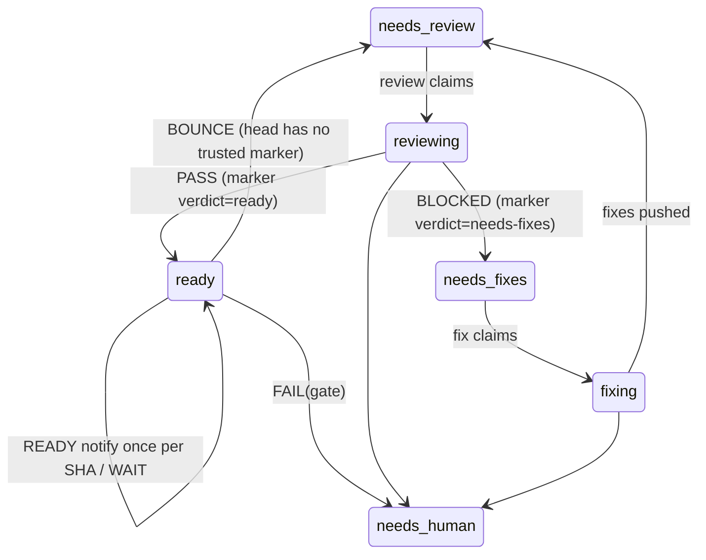

# AFK merge/gate loop — Design

**Status:** proposed, 2026-10-07. Requirements: [requirements.md](requirements.md). Tasks: [tasks.md](tasks.md).

Merge/gate owns `auto:ready`. It is deterministic Node run by GitHub Actions, with no Claude session. Each run sweeps every open `auto:ready` PR and does one of these:
- confirms it is safe to merge and @mentions the maintainer, once per head SHA
- leaves it alone for now
- sends it back for review
- escalates it to the human inbox

It never merges.



## Where it runs

[docs/afk-loops.html](../../../docs/afk-loops.html), lane 4, planned an hourly local Node daemon that sends macOS banners. This spec moves the gate to **GitHub Actions**.

| | Local daemon (old plan) | **GitHub Actions** | Desktop routine |
|---|---|---|---|
| Claude tokens | 0 | **0** (Actions minutes are free on public repos) | every run |
| Laptop closed | no (missed runs coalesce on wake) | **yes** | no |
| Notify latency | 0–60 min, awake only | **~1 min** on the marker event, ≤ 1 h by schedule | cadence + session start |
| Notification | osascript banner, Mac only | **@mention from `github-actions[bot]`**, pushed by GitHub Mobile (to verify) | session notice |
| Write token | ckallum's `gho_` token on the laptop (`repo` scope, every repo) | **`GITHUB_TOKEN`**, job-scoped, no secret | user token in the session |
| Fresh-clone test | fails: needs absolute node/gh paths and a plist in `~/Library` | **passes: merging the workflows is the install** | schedule bound by hand per machine |

What the move costs:
- **Target repos need their own copy of the workflows.** The installer copies nothing into `.github/`, the same gap `afk-enroll.yml` has.
- **Triggers only work from `main`.** They can't be tested from a branch; use `workflow_dispatch` in `dry-run` after merge.
- **No banner.** A read-only local notifier can come later.

`scripts/hooks/babysit-pr-daemon.cjs` is a pattern, not a dependency. Its one-PR, 60-minute lifecycle doesn't fit, and it has bugs the gate must not inherit:
- `notify()` escapes only `"`, which allows AppleScript injection (confirmed by compiling, not running)
- it reads check-runs only, so it misses commit statuses such as CodeRabbit
- `:128` maps `merge_commit_sha` into a field named `mergeStateStatus`
- it counts `NEUTRAL` as a failure

## Triggers

Two workflow files run the same script under one concurrency group. GitHub disables a **whole** workflow file after 60 days without repo activity when it carries a `schedule`, and that would silence the event triggers in the same file. Keeping the cron in its own file means inactivity can only disable the backstop.

```yaml
# .github/workflows/afk-gate.yml — event-driven
on:
  issue_comment:   { types: [created] }        # the review loop's marker lands → evaluate now
  workflow_run:    { workflows: [checks], types: [completed] }   # CI finished; also fires after every push to a PR or to main
  status:                                       # CodeRabbit usually posts a commit status
  check_suite:     { types: [completed] }       # ...and sometimes an app check run (#138); app suites fire this, Actions suites don't
  workflow_dispatch:
    inputs: { mode: { type: choice, options: [dry-run, on], default: dry-run } }
jobs:
  gate:
    if: github.event_name != 'issue_comment' || (github.event.issue.pull_request && contains(github.event.comment.body, 'afk-review reviewed sha='))
    concurrency: { group: afk-gate, cancel-in-progress: false }   # job-level: a run skipped by `if` never takes the pending slot

# .github/workflows/afk-gate-sweep.yml — the backstop
on: { schedule: [{ cron: '17 * * * *' }], workflow_dispatch: {} }
jobs:
  gate: { concurrency: { group: afk-gate, cancel-in-progress: false } }
```

- **Every run sweeps all `auto:ready` PRs**, whichever event started it. A burst of qualifying events collapses into at most one running and one pending sweep.
  - Concurrency sits on the job, not the workflow. At workflow level, an unrelated comment's run would take the single pending slot and cancel the marker's queued sweep before its job was skipped.
  - Never cancel a running sweep: it could be stopped between a comment and a label move.
- **`issue_comment` replaces `pull_request_target: labeled`.** The review loop sets `auto:ready` about 2 s *before* it posts the SHA marker (#145: 10:35:56 → 10:35:58), so a run started by the label would find no marker. A stranger can post text that passes the filter; that only causes an extra sweep, and the gate authenticates every marker it reads.
- **No trigger attaches the gate to a PR head.** A `pull_request_target` run attaches its check run to the PR's head SHA — the `afk-enroll` run sits on #145's `2d689e8` — so a gate started that way would see its own in-progress check. Runs started by `issue_comment`, `workflow_run`, `status`, `check_suite` and `schedule` attach to the default branch.
- **The gate's writes don't retrigger it.** Events created with `GITHUB_TOKEN` start no workflows. The review loop writes with a user token, so its marker comment does fire `issue_comment`.
- **No `pull_request_review` trigger in v1.** It runs with a read-only token on fork PRs and has no `_target` variant. The hourly sweep picks up requested changes.
- **Inactivity.** If the sweep file is disabled, re-enable it with `gh workflow enable afk-gate-sweep.yml`.

## Configuration and identity

Repo variables are set with `gh variable set NAME --body VALUE` and read by both workflows:

| Variable | Required | Default | Meaning |
|---|---|---|---|
| `AFK_LOOP_LOGIN` | **yes** | — | The login the review loop runs as. Only review markers authored by it count. If unset, the job fails red and writes nothing. |
| `AFK_NOTIFY` | no | `AFK_LOOP_LOGIN` | Who the READY comment @mentions. |
| `AFK_GATE_MODE` | no | `dry-run` | `off` exits at once; `dry-run` writes only the job summary; `on` writes. |
| `AFK_GATE_REQUIRED_CHECKS` | no | `guards` (set in calsuite's workflow) | Comma-separated context names that must be present and `SUCCESS`. |

- **Effective mode.**
  - `AFK_GATE_MODE=off` always wins.
  - Otherwise a `workflow_dispatch` run uses its `mode` input.
  - Every other run uses `AFK_GATE_MODE`.
- **Why `AFK_LOOP_LOGIN` is a variable and not a lookup.** The gate acts as `github-actions[bot]`, while the review loop runs as a user. No call the gate can make reveals the review loop's login. A wrong value is dangerous:
  - every PR would bounce, because no marker is trusted
  - the review loop would then skip each one, because it finds its own marker
  - the PR stalls

  So the variable has no default, and the `config-mismatch` row of the binding table catches a mismatch.
- **Token.** The gate uses the job-scoped `GITHUB_TOKEN`.
  - `permissions: {}` at the top level.
  - On the job: `contents: read`, `issues: write`, `pull-requests: write`, `checks: read`, `statuses: read`, `actions: read`. `actions: read` is there in case reading workflow names needs it; trim the list during the dry-run.
- **Checkout.** The job checks out `ref: ${{ github.event.repository.default_branch }}` with `persist-credentials: false` to get the gate script. It never checks out or runs PR code.

## Snapshot

Each run builds one snapshot per PR, then evaluates it with a pure function.

1. **A GraphQL page of open `auto:ready` PRs**, `first: 10`, paginated (tested against calsuite at about 11 points a page). Per PR it fetches:
   - `number state isDraft isCrossRepository headRefOid baseRefName mergeable mergeStateStatus reviewDecision`
   - `labels(first: 30)`
   - `statusCheckRollup.contexts(first: 100)` with `totalCount`:
     - each CheckRun's `name status conclusion startedAt` and its workflow name
     - each StatusContext's `context state description createdAt`
   - `reviewThreads(first: 100)` with `totalCount`, and each thread's `isResolved isOutdated` plus its first comment's author and `authorAssociation`
   - `baseRef { target { committedDate } refUpdateRule { requiredStatusCheckContexts requiresConversationResolution } }`
2. **REST, per PR.** REST reports bots as `name[bot]`; GraphQL drops the suffix.
   - `repos/R/issues/N/comments --paginate`, for markers, with `user.login` and `author_association`.
   - `repos/R/issues/N/timeline --paginate`, for when `auto:ready` was last applied and when the head was last pushed (`committed` / `head_ref_force_pushed`).
3. **REST compare, only for same-repo PRs that reach check 11.** `repos/R/compare/<head>...<base>` gives the behind-by note. A failure drops the note; it never makes the PR `error`.
   - GraphQL `headRef.compare` is not used: on a fork it looks for the base branch in the fork, errors, and would keep the fork from ever reaching `FAIL(fork)`.

Snapshot rules (fail closed):
- **`error`.**
  - A failed REST call for a PR, or a GraphQL `errors` entry whose `path` points into that PR's node, makes that PR `error` for this run. That means no writes and no age cap.
  - Other PRs on the page still evaluate. The runner parses `data` even when `gh` exits 1.
  - After writing the summary, the job exits non-zero if any PR is `error`, so a persistent fault shows as a red run.
- **`WAIT(truncated)`.** `totalCount` above the nodes fetched, on contexts or threads.
- **`WAIT(unknown-value)`.** An enum value the gate doesn't know, including values GitHub adds later.

### Markers

| Marker | Written by | Trusted when | Body |
|---|---|---|---|
| review | afk-review | `user.login == AFK_LOOP_LOGIN`, and the whole body equals one of the forms → | `<!-- afk-review reviewed sha=<40hex> verdict=ready\|needs-fixes -->`, or the legacy form with no verdict |
| ready | gate | `user.login == "github-actions[bot]"`, and one line equals → | `<!-- afk-gate ready sha=<40hex> -->` |
| bounce | gate | same | `<!-- afk-gate bounce sha=<40hex> -->` |
| escalate | gate | same | `<!-- afk-gate escalate gate=<id> sha=<40hex> -->` |

- **afk-review writes its marker only if the head is still the SHA it selected after `/review` finished** (v0.3.0, block 7). So a marker never names a revision the review might not have seen.
- **Matching.** Review markers need a whole-body match, so a review that quotes the marker in prose doesn't count. Gate comments carry human text, so their markers match a whole line.
- **Strangers can't post as `github-actions[bot]`.** A fork's `pull_request` workflow gets a read-only token.
- **The head's verdict** comes from the *latest* trusted review marker whose SHA equals the head.

## Gate table

`evaluate(snapshot, config, now)` returns one outcome. Checks run in this order:

| # | Check | Outcome |
|---|---|---|
| 0 | `state != OPEN`, or `auto:ready` gone | `skipped` |
| 1 | `auto:needs-human` also present | `skipped (in inbox)`: silent, no writes |
| 2 | `isDraft` | `WAIT(draft)` (no age cap) |
| 3 | another `auto:*` label also present | `WAIT(label-race)` |
| 4 | `isCrossRepository` | `FAIL(fork)`. v1 never announces a fork as ready: the fork author controls its CI (it can edit `checks.yml`), and its content reached the review model unfiltered. |
| 5 | **review binding** (below) | pass, or `BOUNCE`, `WAIT(marker-lag)`, or `FAIL(review-blocked \| review-unverified \| review-marker-missing \| bounce-cap \| config-mismatch)` |
| 6 | `reviewDecision` | `CHANGES_REQUESTED` → `FAIL(changes-requested)`; `REVIEW_REQUIRED` → `FAIL(approval-required)`; `null` and `APPROVED` pass. GitHub computes this without protection (seen on an unprotected repo that reported `CLEAN`). |
| 7 | `mergeable` | `CONFLICTING` → `FAIL(conflict)`; `UNKNOWN` → `WAIT(mergeable-unknown)`, because GitHub computes it lazily |
| 8 | **CI** (below) | `FAIL(ci-failed)`, `WAIT(ci-pending \| ci-missing \| truncated)`, or pass |
| 9 | `mergeStateStatus` | `DIRTY` → `FAIL(conflict)`; `BEHIND` → `FAIL(behind)`; `BLOCKED` → `WAIT` if check 8 waited, else `FAIL(protection)`; `UNKNOWN` → `WAIT(mergeable-unknown)`; `UNSTABLE` → defer to check 8; `CLEAN` and `HAS_HOOKS` pass |
| 10 | review threads | Unresolved, not outdated, and started by a writer (`OWNER`/`MEMBER`/`COLLABORATOR`, not a bot) → `FAIL(unresolved-thread)`. With `requiresConversationResolution`, any unresolved thread fails. Bot threads become a note. |
| 11 | everything passed | `READY`, with notes: base behind by N (lenient on an unprotected base), CodeRabbit "rate limited" or "skipped", open bot threads |

**Combining checks.**
- Checks 0–5 stop at the first decisive result. A `BOUNCE` stops evaluation: CI results for unreviewed commits don't matter.
- Checks 6–10 all run. The first `FAIL` in table order wins, then the first `WAIT`, otherwise `READY`. A definite failure is never hidden behind a pending check.

**Age cap.** A `WAIT` other than `draft` becomes `FAIL(stuck:<cause>)` once its *cause* has lasted more than 24 h.
- The clock starts at the later of (`auto:ready` applied) and (the cause's start). Cause starts:

| Cause | Start |
|---|---|
| `ci-pending` | the oldest non-completed CheckRun `startedAt`, or PENDING StatusContext `createdAt` |
| `ci-missing` | the head's last push |
| `mergeable-unknown` | the later of the head's last push and the base tip's `committedDate` |
| `marker-lag`, `label-race`, `truncated`, `unknown-value` | when `auto:ready` was applied |

- A merge to the base therefore restarts the clock for every PR that reads `UNKNOWN` afterwards. A PR announced ready days ago is never escalated by a passing recomputation.
- A cause whose start can't be determined is never capped. It stays a `WAIT`, visible in every summary.
- Hitting the cap never yields `READY`.

### Review binding (check 5)

This is the gate's half of a contract with afk-review's SHA-skip.
- The review loop skips a PR when **any** trusted marker exists for its head.
- So the gate may send a PR to `auto:needs-review` **only** when no trusted marker exists for its head.
- If the gate bounced a PR whose head had a marker, the review loop would skip it on every run, and the PR would sit in `auto:needs-review` forever.

| Trusted review markers at the head | afk-review would | Gate outcome |
|---|---|---|
| latest is `verdict=ready` | skip | pass → check 6 |
| latest is `verdict=needs-fixes` | skip | `FAIL(review-blocked)`: reviewed BLOCKED at this SHA, so it was relabelled by hand or force-pushed back |
| latest is legacy (no verdict) | skip | `FAIL(review-unverified)` |
| none, and `auto:ready` was applied < 10 min ago, or no `labeled auto:ready` event was found | — | `WAIT(marker-lag)` |
| none, and a trusted `bounce` marker for this SHA exists | review it | `FAIL(review-marker-missing)`: a review was already requested at this exact SHA and left no marker, so a second bounce can't help |
| none, and the PR has ≥ 3 trusted bounce markers | review it | `FAIL(bounce-cap)`: ready → re-review → ready can't cycle forever |
| none, and an exact-form review marker exists whose author is not `AFK_LOOP_LOGIN` but whose `author_association` is `OWNER`, `MEMBER` or `COLLABORATOR` | — | `FAIL(config-mismatch)`: `AFK_LOOP_LOGIN` probably names the wrong login, and bouncing would stall the PR. A stranger's marker (association `NONE`) never triggers this. |
| none | review it | `BOUNCE` |

A force-push back to a SHA reviewed as PASS earlier reads as `verdict=ready`. That's correct: that exact code passed review.

### CI (check 8)

- **Excluded.** Contexts from AFK workflows — any CheckRun whose workflow name starts with `afk-` (afk-enroll, afk-gate) — are automation, not CI. Otherwise a failed enrol run would turn the rollup red for no CI reason.
- **Each remaining context is classified on its own,** rather than trusting `rollup.state`:
  - CheckRun with a non-`COMPLETED` status → `WAIT`
  - CheckRun conclusion `SUCCESS`, `NEUTRAL` or `SKIPPED` → pass (#138's "CodeRabbit / Review" was `NEUTRAL` inside a `SUCCESS` rollup); any other conclusion → `FAIL`
  - StatusContext `PENDING` or `EXPECTED` → `WAIT`; `FAILURE` or `ERROR` → `FAIL`; `SUCCESS` → pass
- **Required contexts.** Every name in `AFK_GATE_REQUIRED_CHECKS`, plus any `requiredStatusCheckContexts` from a base rule, must be present and `SUCCESS`.
  - A missing one → `WAIT(ci-missing)`; one present but not `SUCCESS` → `FAIL(ci-failed)`.
  - An empty required list is a configuration error: the job fails red.
  - Without this rule, zero checks read as green. An unprotected repo with a `null` rollup still reports `CLEAN`, and Actions being disabled, or a first-time contributor's run awaiting approval, look the same.
- **Never `gh pr checks`.** With zero checks it prints text and exits 1, and exit 1 also means a failure or "no required checks".

## Writes

Before every write, the gate re-reads the PR with `gh pr view N --json state,labels,headRefOid`. If the PR is no longer open, has lost `auto:ready`, or its head changed since the snapshot, it records `skipped (changed during run)` and writes nothing. A BOUNCE also re-fetches the comments just before its label move, and skips the same way if a trusted review marker for the head has appeared.

| Outcome | Dedupe (trusted gate markers) | Writes, in order |
|---|---|---|
| `READY` | a `ready` marker for this SHA exists → `ready (already notified)` | comment |
| `BOUNCE` | a `bounce` marker for this SHA exists → that's `FAIL(review-marker-missing)` instead | comment; add `auto:needs-review`; remove `auto:ready` |
| `FAIL(g)` | an `escalate` marker for (g, SHA) exists → skip the comment | comment; add `auto:needs-human`; remove `auto:ready` |
| `WAIT`, `skipped`, `error` | — | none |

- **Each label step runs only after the one before it succeeded.** This copies the comment-before-move rule in afk-review Step 4 and afk-fix Step 4.
- **Add and remove are separate calls, add first.** `gh` applies them as separate mutations either way. Adding first means a failure leaves one of two states, and never a PR with no AFK label:
  - `{ready, needs-review}`: the review loop still selects it, and its claim heals the labels
  - `{ready, needs-human}`: already in the inbox
- **Retry.** A failed step leaves `auto:ready` in place, and the next run retries; the dedupe skips the comment.

Comment bodies use a fixed vocabulary:
- The only PR-derived values are SHAs (validated as 40 hex) and check names. Check names are sanitised to `[A-Za-z0-9 ._/:-]{1,60}` and put in code spans.
- No titles, branch names or descriptions: the gate posts as a trusted identity, so echoing them would allow @mention spam or link injection.

```text
@<AFK_NOTIFY> ready to merge: `<sha7>` passed the AFK gate.
- <note>                      (only when there are notes)
<!-- afk-gate ready sha=<sha> -->

afk-gate: escalating to needs-human — <fixed sentence for the gate>. `gate=<id> sha=<sha7>`
<!-- afk-gate escalate gate=<id> sha=<sha> -->

afk-gate: no AFK review marker exists for head `<sha7>`, so this PR goes back for review.
<!-- afk-gate bounce sha=<sha> -->
```

## How it fits the other loops

| Loop | Change |
|---|---|
| afk-review | **This PR (#141).** The marker records `verdict=` and is written only for a head unchanged across the review. The SHA-skip trusts only the loop's own login, matches exactly, and treats any lookup failure as an error, never a skip. Every bash block is self-contained. |
| afk-fix | None. The gate never routes to `auto:needs-fixes`. A conflict or red CI goes to a human, because afk-fix has no sync-with-base step and doesn't read CI logs. Sending those there would burn a convergence and end in its "converged without changing code" escalation, or loop. |
| afk-enroll | None in v1. It enrols fork PRs, so forks reach the review model (to be filed: tasks.md Follow-ups). |
| babysit-pr | None in v1. `ci-monitor.cjs` spawns it on every `gh pr create`, and it announces "ready to merge" on green CI regardless of review, which contradicts the gate (to be filed). |
| Human inbox | See below. |

**Leaving `auto:needs-human`:**
- Relabel `auto:needs-review` for a fresh review.
- Relabel `auto:ready` only at a head with a PASS marker; otherwise the gate bounces it.
- To force a re-review at an unchanged head, delete the review marker comment or push a commit. Otherwise the review loop's SHA-skip holds the PR.

## Failure modes

| Risk | Mitigation |
|---|---|
| Zero or missing checks read as green | required contexts must be present and `SUCCESS`; an empty list fails the job |
| Truncated or partial GraphQL hides a failure | `totalCount` check → `WAIT`; `errors` → `error` and a red run |
| A forged review marker passes unreviewed code | author must be `AFK_LOOP_LOGIN`, exact body |
| A marker names a SHA the review never saw | afk-review marks only a head unchanged across the review |
| A forged gate marker suppresses a notice or an escalation reason | author must be `github-actions[bot]` |
| Force-push back to a BLOCKED SHA | `verdict=` in the marker → `FAIL(review-blocked)` |
| Gate and review skip disagree, so a PR stalls in `needs-review` | the binding table is the exact complement of the skip; `config-mismatch` catches a wrong login; BOUNCE re-checks markers before moving |
| Ready → bounce → ready cycles burn review tokens | `review-marker-missing` at one SHA; `bounce-cap` after 3 |
| Pending forever (stuck CodeRabbit, unknown mergeability) | 24 h cause-anchored cap → `FAIL(stuck)`, never `READY` |
| A long-ready PR escalated by a routine recomputation | the cap clock starts at the cause, not the label |
| An unrelated comment cancels the queued sweep | concurrency at job level, behind the comment filter |
| A partial label move orphans a PR | add before remove, so a failure leaves the PR in a selected or inbox state |
| PR-controlled strings in a trusted comment | fixed vocabulary; sanitised check names |
| Code pushed between the notice and the human's tap on merge | not closed in v1 (the notice names the SHA); closed by [v2 enforced mode](#v2-enforced-mode) |
| 60 quiet days disable the scheduled workflow | the cron is in its own file, so only the backstop goes dark; `gh workflow enable afk-gate-sweep.yml` |

## Testing

- **Unit.** `scripts/lib/afk-gate.cjs` exports `evaluate(snapshot, config, now)` and the marker parsers. Fixtures live in `scripts/test-fixtures/afk-gate/`:
  - snapshots captured from real PRs, such as #145's final state and #132's hand-labelled `auto:ready`
  - synthetic edge cases, one per row of the gate and binding tables, plus "announced ready 30 h ago, base moved 1 min ago, `UNKNOWN`" → `WAIT`
  - run with `node --test`, in `checks.yml`
- **Marker drift.** A test asserts that the marker format in `skills/afk-review/SKILL.md` and the regex in `scripts/lib/afk-gate.cjs` describe the same strings. `scripts/test-afk-review-blocks.sh` already round-trips the skill's own writer and reader.
- **Runner.** A stub-`gh` harness, like `scripts/test-afk-fix-blocks.sh`, covering:
  - write order: comment, add, remove
  - the re-read abort
  - the BOUNCE marker re-check
  - dedupe
  - partial GraphQL errors staying on one PR
  - `dry-run` and `off` writing nothing
- **Live, after merge, in `dry-run`.**
  1. Run `workflow_dispatch` and read the summary.
  2. Switch to `on` and run a trial PR through each path:
     - ready → notify
     - push → bounce
     - an induced conflict → `FAIL(conflict)`
     - a non-marker comment during a running sweep → the queued sweep survives

## Key decisions

| Decision | Choice | Rationale |
|---|---|---|
| Runner | GitHub Actions | 0 tokens, laptop-independent, no write token on disk, passes the fresh-clone test |
| Notification | @mention by `github-actions[bot]` | GitHub Mobile pushes direct mentions (to verify); a mention written with ckallum's own token would be a self-mention |
| Unreviewed head | `BOUNCE` to `auto:needs-review` | cheap and automatic; the review loop re-reviews only the new head |
| Conflict / red CI | `FAIL` to `auto:needs-human` | afk-fix can't resolve either |
| Forks | never `READY` | the fork controls its CI, and its content reached the model |
| Claim label (`auto:gating`) | none | a single runner via the concurrency group, plus a re-read before every write; a claim would need bootstrap changes and its own sweep |
| Default mode | `dry-run` | rollout safety; go live with one `gh variable set` |
| Merging | never | "prepare, don't merge", as in the original design |

## v2: enforced mode

The gate also posts a commit status, `afk/gate`, on the head:
- `success` on READY
- `failure` on FAIL or BOUNCE
- `pending` on WAIT

A ruleset on `main` makes the status required, with an admin bypass. The merge button then refuses any head pushed after the notification, which closes the gap between notice and merge.

This needs `statuses: write`, and the CI classifier must exclude `afk/gate`. It also changes how the maintainer merges on today's unprotected `main`, so it is a separate decision.

## Security considerations

- **Public repo.** Anyone can comment or open a fork PR. The gate's trust boundary is:
  - comments by `AFK_LOOP_LOGIN` or `github-actions[bot]` in exact marker form
  - labels, which need triage rights
  - fields GitHub computes
- **Execution.** The job runs only default-branch code, with a job-scoped token and no secrets.
- **Same-repo PR authors are collaborators.** They can already edit `checks.yml`, and the gate trusts them as much as the review loop does.
- **Related, out of scope (to be filed).** `/receiving-pr-feedback` reads every PR comment with no author filter, and afk-fix acts on what it returns. So a stranger's comment on a same-repo PR counts as review feedback.

## To verify while building

- That a `github-actions[bot]` @mention pushes to GitHub Mobile. Trial PR.
- Which job permissions are actually needed, in particular whether reading a check run's workflow name needs `actions: read`. Dry-run.
- Whether a failed run that was later re-run successfully still appears in `statusCheckRollup`. Capture a fixture. Until known, any `FAIL` context fails the gate (fail closed).
- That CodeRabbit's commit statuses fire `status`, and its app check suites fire `check_suite`, for this workflow. Trial PR.
- That a run whose job is skipped by `if` never displaces a pending sweep, by posting a non-marker comment during a sweep in dry-run.
